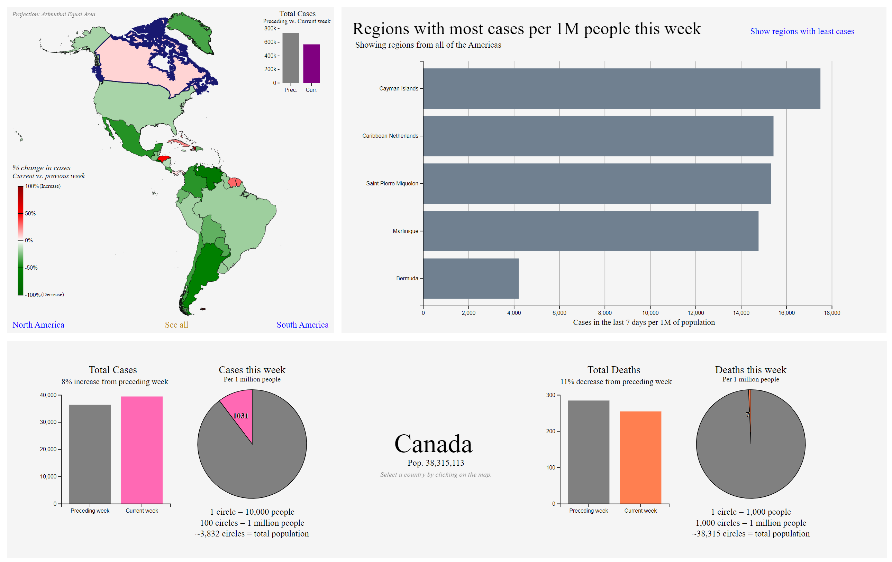

# COVID Cases Visualizations
This is set of interactive data visualizations comparing COVID cases between weeks. The data used for this demo is from March 2022 but the code is adaptable to display data from appropriate .csv files from any time.

The map is animated. In addition to displaying both Americas, the map can also be set to focus on either North or South America. A country can be selected either by clicking on the map or clicking on a bar from the "most/least cases per 1m people" chart on the right (as displayed below). When a country is selected, its outline on the map is highlighted and the country-specific data is displayed on the bottom.

## Preview

